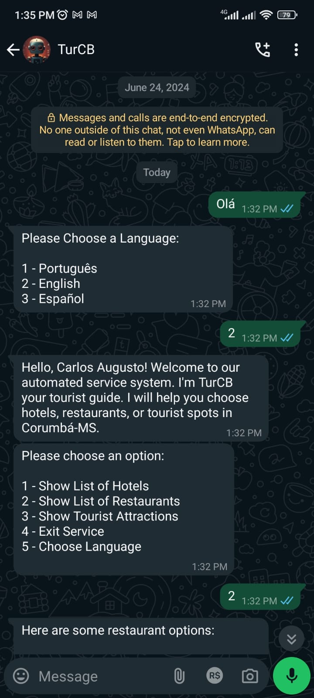
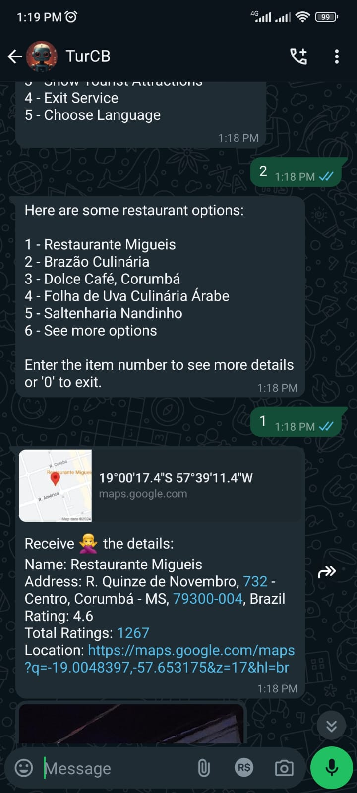
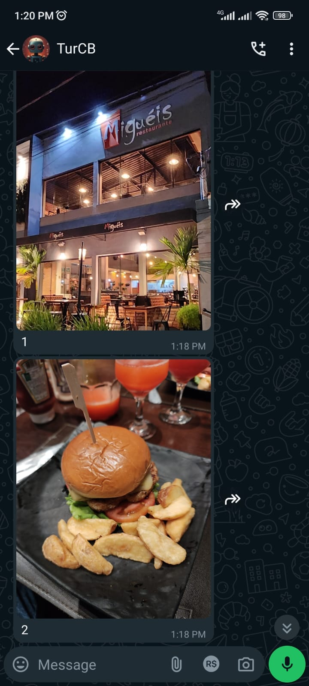
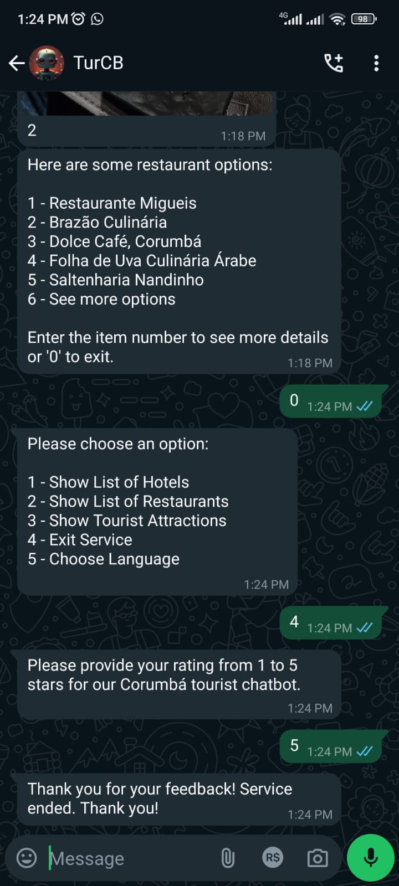

## 🚀 Começando


Essas instruções permitirão que você obtenha uma cópia do projeto em operação na sua máquina local para fins de desenvolvimento e teste.

Esse projeto foi desenvolvido como requisito parcial da obtenção de titulo de graduação em Análise e Desenvolvimento de Sistemas do IFMS - Campus Corumba.

**Tecnologias e Ferramentas**


### 📋 Pré-requisitos

**Alguns pré requisitos que você deve ter instalados no computador.**

1 - Visual Studio Code 1.85.0 (ou mais recente)

2 - Node v20.11.1 (ou mais recente)

3 - MongoDB Compass 1.43.1

4 - Git 2.45

5 - Extensão Live Server do Visual Studio Code. (Opcional)

**Executar no cmd, power shell ou git bash.**

```
$ git clone https://github.com/augustok99/turcb_bot.git
```

Ao baixar o projeto, digite o seguinte comando para baixar todas as dependências:

```
$ npm i
```

### 🔧 Requisitos Obrigatórios

**Alguns requisitos que você precisa seguir para conseguir executar o sistema.**

1 - Criar uma conta no [MongoDB Atlas](https://www.mongodb.com/cloud/atlas/register) e gerar uma chave secreta (uri) para ser usada como conexão no banco de dados.

2 - Criar uma conta google e acessar a [API do Google Cloud](https://cloud.google.com/apis?hl=pt-BR) buscando por Google Places e gerando uma chave secreta.

## ❗Importante

1 - Antes de executar o projeto você deve criar um banco no MongoDB Compass chamado "bot_system" sem aspas.

2 - É importante ficar atento ao número de celular, que será usado como host, pois a biblioteca não garante eventuais perdas de conta whatsapp por infringir os termos de uso da Empresa Meta proprietária do mensageiro Whatsapp.

3 - É importante ficar atento ao consumo das requisições api Google Places, pois há um limite gratuito estabelicido pela empresa Google.

4 - Você deve executar os módulos coletores separadamente com o node e executar o módulo responsável pelo salvamento dos arquivos json no banco MongoDB.

5 - Você precisa criar o arquivo .env com as chaves secretas do MongoDB Uri e Google Places API.

## 🐦‍⬛ Executando o Projeto

```
$ npm start
```

## ☕Preview

##  

---

##  

## 🛠️ Construído com

- [Whatsapp-web.js](https://github.com/pedroslopez/whatsapp-web.js) - Biblioteca whatsapp-web.js
- [NodeJS](https://nodejs.org/en) - Gerente de Dependência
- [MongoDB](https://www.mongodb.com/) - Banco de dados não relacional

## 📃Docs

**Para visualizar a documentação do projeto feito com a biblioteca JSDoc digite o seguinte comando:**

```
$ git run docs
```

A documentação gerada automaticamente se encontra no diretório /src/docs, você pode visualizar o html com live server.

## ✒️ Autores

- **Carlos Augusto Moreira da Silva** - _Dev Analista de Sistemas_ - [Augusto99MK](https://github.com/Augusto99MK)

---

⌨️ com ❤️ por [Carlos Augusto](https://github.com/augustok99) 😊

<p align="left">
  Onde me encontrar: ⤵️
</p>

<p align="left">
  <a href="mailto:carlosaugustox6@gmail.com" title="Gmail">
  </a>
  <a href="https://www.linkedin.com/in/augustok99/" title="LinkedIn">
  </a>
  <a href="https://www.facebook.com/carlosaugustomk/" title="Facebook">
  </a>
  <a href="https://www.instagram.com/dev.carlos_aug/" title="Instagram">
  </a>
</p>

## License

Direitos autorais 2024 Carlos Augusto

Licenciado sob a Licença Apache, Versão 2.0 (a "Licença");
você não pode usar este projeto, exceto em conformidade com a Licença.
Você pode obter uma cópia da Licença em http://www.apache.org/licenses/LICENSE-2.0.

A menos que exigido pela lei aplicável ou acordado por escrito, software
distribuído sob a Licença é distribuído em uma BASE "AS IS", ou seja,
SEM GARANTIAS OU CONDIÇÕES DE QUALQUER TIPO, expressas ou implícitas.
Consulte a Licença para o idioma específico que rege as permissões e
limitações sob a licença.

---

Este projeto não é afiliado, associado, autorizado, endossado ou de qualquer forma oficialmente conectado ao WhatsApp ou a qualquer uma de suas subsidiárias ou afiliadas. O site oficial do WhatsApp pode ser encontrado em whatsapp.com. "WhatsApp", bem como nomes, marcas, emblemas e imagens relacionados são marcas registradas de seus respectivos proprietários. Também não é garantido que você não será bloqueado usando este método. O WhatsApp não permite bots ou clientes não oficiais em sua plataforma, portanto, isso não deve ser considerado totalmente seguro.
